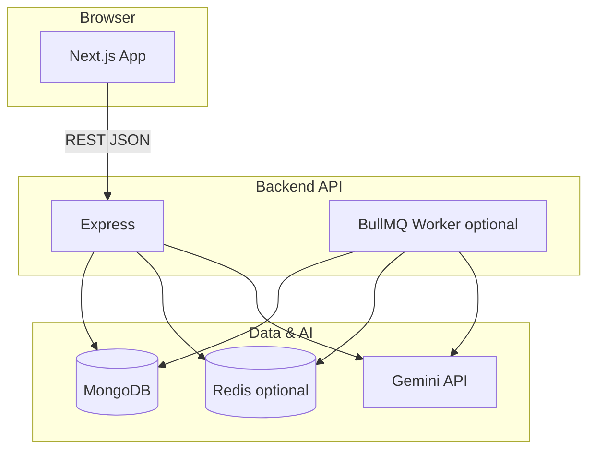

# AI Code Understanding & Refactoring Engine

A full-stack system to **ingest** code (ZIP or public GitHub), **parse** it with Tree-sitter (WASM), run **static analysis** (complexity, smells, dependency graph), enrich with **Google Gemini** explanations and refactor hints, and **explore** everything in a Next.js dashboard—including a **React Flow** visualization.

---

## Features

| Area | What you get |
|------|----------------|
| Ingestion | ZIP extract (safe paths) + shallow GitHub clone |
| AST | Bounded Tree-sitter serialization stored in MongoDB |
| Analysis | Cyclomatic complexity, code smells, import graph |
| AI (Gemini) | Per-file explanations, issues, suggestions (batched, cached, chunked) |
| Scale | Optional **BullMQ + Redis** for background analysis + progress polling |
| UI | Dashboard with file tree, metrics, suggestions, graph & heatmap |

---

## Architecture



- **Without `REDIS_URL`**: `POST /analyze` runs **inline** (still uses Gemini; no Redis cache).
- **With `REDIS_URL`**: jobs are **queued**; embedded or standalone **worker** runs analysis + Gemini; **Redis** caches Gemini batch responses by content fingerprint.

---

## Gemini integration (official API)

- Uses the **Google Generative Language API** (`generateContent`) with JSON output mode.
- **Secrets**: only `GEMINI_API_KEY` in environment (see `backend/.env.example`). Never commit keys.
- **Fallbacks**: if the key is missing, analysis still completes; the UI shows a clear notice. Transient errors use retries + backoff; partial batch failures surface a user-visible notice without crashing the API.
- **Efficiency**: adaptive batching by character budget, outline chunking for large files, Redis deduplication of identical batch prompts.

---

## Quick start (local, no Docker)

### Prerequisites

- Node **20+**
- **MongoDB** (local or Atlas)
- Optional: **Redis** (for queue + cache), **Gemini API key**

### Backend

```bash
cd backend
cp .env.example .env
# Edit .env — set MONGODB_URI, optionally GEMINI_API_KEY, REDIS_URL
npm ci
npm run build
npm run dev
```

API: `http://localhost:4000` — try `GET /health`.

### Frontend

```bash
cd frontend
cp .env.local.example .env.local
# Set NEXT_PUBLIC_API_URL=http://localhost:4000
npm ci
npm run dev
```

App: `http://localhost:3000`

### Optional worker (Redis, `WORKER_EMBEDDED=false`)

```bash
cd backend
npm run dev:worker
```

---

## Docker Compose

1. Copy env file: `cp .env.docker.example .env.docker` and set **`MONGODB_URI`** (required) and optionally **`GEMINI_API_KEY`**.
2. From repo root:

```bash
docker compose up --build
```

- Frontend: http://localhost:3000  
- API: http://localhost:4000  
- Redis: `localhost:6379` (for debugging only; not exposed in production setups)

---

## Deployment

See **[docs/DEPLOYMENT.md](docs/DEPLOYMENT.md)** for **Vercel** (frontend), **Railway / Render** (backend), and **Upstash / Redis Cloud** (Redis).

Summary:

- **Vercel**: project root `frontend`, env `NEXT_PUBLIC_API_URL` → your API URL.
- **Railway / Render**: root `backend`, build `npm ci && npm run build`, start `node dist/main.js`, set `MONGODB_URI`, optional `REDIS_URL`, `GEMINI_API_KEY`.

---

## Screenshots

> **Add your own** after first successful run (keeps the repo free of large binaries). Suggested captures:
>
> 1. **Home** — ZIP + GitHub + Analyze with progress steps.  
> 2. **Dashboard — Overview** — file tree + analysis panel + suggestions.  
> 3. **Dashboard — Graph** — React Flow with complexity heatmap.  
> 4. **Node detail** — Gemini explanation side panel.

Save PNG/WebP files under [`docs/screenshots/`](docs/screenshots/) and link them here if you publish the repo.

---

## Verification

From repository root:

```bash
npm run verify
```

### Windows: path with `&` in the folder name

If `next build` fails during **Collecting page data** with `PageNotFoundError` / `ENOENT` for `/dashboard/[id]` or `/_not-found`, the ampersand in a parent directory (e.g. `... & Refactoring Engine`) can break Next.js path resolution. **Workarounds:** clone or move the repo to a path without `&`, or map a drive letter, for example:

```powershell
subst X: "D:\path\to\AI Code Understanding & Refactoring Engine\frontend"
Set-Location X:\
npm run build
subst X: /d
```

CI, Docker, and Vercel builds are unaffected because their working directories do not include `&`.

Runs production builds for `backend` and `frontend`. For an end-to-end manual test:

1. Ingest a small repo or ZIP.  
2. Click **Analyze** (watch progress if Redis is enabled).  
3. Open **Dashboard** → confirm metrics, optional AI text, **Graph** tab.

---

## Repository layout

```
backend/          Express API, Mongoose, Tree-sitter WASM, BullMQ worker
frontend/         Next.js 15 App Router, TanStack Query, React Flow
docs/             DEPLOYMENT.md (+ screenshots when you add them)
docker-compose.yml
```

---

## License

Private / your choice — set `license` in `package.json` when you publish.
